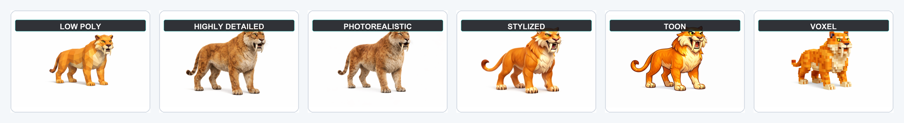

# Codex 3D Asset

`codex-3d-asset` is a Codex plugin with a local MCP preview widget and automatic runtime bootstrap.

It gives Codex a clear workflow for:

- generating clean reference images for 3D conversion
- enforcing a seamless white background
- removing cast, contact, and ambient shadows
- removing floor gradients, visible ground planes, and under-foot darkening
- forcing a front-view T-pose for characters
- resolving style from explicit instructions or visual references
- preparing asset packs from reusable templates
- handing the result off to Tripo through the official API inside Codex
- asking for explicit user confirmation before spending Tripo credits when needed
- bootstrapping the local MCP dependencies automatically on first launch
- starting a plugin-scoped local viewer server automatically
- opening a local 3D preview widget in Codex after a previewable model is downloaded

## Plugin Contents

- `.codex-plugin/plugin.json`: Codex plugin manifest
- `skills/codex-3d-asset/SKILL.md`: plugin workflow and operating rules
- `assets/icon.svg`: plugin icon
- `assets/soldier-helmet-logo.png`: plugin logo
- `.mcp.json`: local MCP server entrypoint for the preview widget
- `package.json`: local widget server dependencies and scripts
- `data/setup.json`: required setup values
- `data/download-formats.json`: download format defaults and conversion rules
- `data/tripo-credit-policy.json`: Tripo credit disclosure rules
- `data/tripo-api.json`: Tripo API workflow reference
- `data/style-example-gallery.json`: bundled visual style chooser
- `data/style-presets.json`: canonical style labels and defaults
- `data/reference-rules.json`: image-generation constraints
- `data/handoff-flow.json`: Tripo confirmation and preview flow
- `data/pack-templates/football-match-low-poly.json`: reusable pack template
- `data/assets/`: bundled sample assets and textures
- `docs/AGENTS.example.md`: persistent-preferences template
- `viewer/index.html`: local 3D preview page
- `outputs/`: plugin-scoped previewable downloads
- `mcp-server/bootstrap.mjs`: dependency and viewer bootstrap entrypoint
- `mcp-server/local-viewer-server.mjs`: local static server for the viewer and outputs
- `mcp-server/server.mjs`: local MCP server for the preview widget
- `mcp-server/public/asset-preview-widget.html`: Codex preview widget UI

## Install

Clone the repository:

```bash
git clone https://github.com/anisayari/codex-3d-asset.git
cd codex-3d-asset
```

Copy the plugin into your local Codex plugins directory:

```bash
mkdir -p ~/plugins/codex-3d-asset
rsync -a --delete --exclude .git ./ ~/plugins/codex-3d-asset/
```

Then refresh Codex so the new local MCP tool descriptors are reloaded.

On the first MCP launch, the plugin now checks its local Node dependencies and installs any missing packages automatically. It also starts the local viewer server automatically and prepares `outputs/` for previewable downloads.

That means there is no normal `npm install` step for end users anymore.

Make sure `~/.agents/plugins/marketplace.json` contains this entry:

```json
{
  "name": "codex-3d-asset",
  "source": {
    "source": "local",
    "path": "./plugins/codex-3d-asset"
  },
  "policy": {
    "installation": "AVAILABLE",
    "authentication": "ON_INSTALL"
  },
  "category": "Productivity"
}
```

## What Is Automatic

After the plugin bundle is installed in Codex, these steps are automatic:

- local MCP dependency check
- local dependency installation when `node_modules` is missing
- local viewer server startup
- creation of the plugin `outputs/` directory for previewable assets
- generation of a local runtime file at `.codex-runtime/viewer.json` so Codex can reuse the active viewer port

Two things are still necessarily manual:

- the plugin must exist in a Codex marketplace and be installed once
- `TRIPO_API_KEY` must already be present in the environment available to Codex

If the key is missing during a Tripo request, the plugin should ask the user to paste it directly in the chat and continue the same workflow after they provide it.

If you do not already have a marketplace file, the minimal shape is:

```json
{
  "name": "local",
  "interface": {
    "displayName": "Local Plugins"
  },
  "plugins": [
    {
      "name": "codex-3d-asset",
      "source": {
        "source": "local",
        "path": "./plugins/codex-3d-asset"
      },
      "policy": {
        "installation": "AVAILABLE",
        "authentication": "ON_INSTALL"
      },
      "category": "Productivity"
    }
  ]
}
```

## Usage

After installation, use prompts such as:

- `Create a low poly knight in a front-view T-pose on white, then send it to Tripo.`
- `Generate every low poly asset needed for a soccer match.`
- `Use these example images to define the style, then prepare the asset for Tripo.`
- `Create a stylized horse for Tripo and download it as FBX.`

## Persistent Preferences with AGENTS.md

OpenAI's Codex best practices recommend using `AGENTS.md` to stop repeating the same instructions manually and to encode how you want Codex to work in a repository. OpenAI also documents that you can use a global file in `~/.codex/AGENTS.md` for personal defaults, plus repo-level and subdirectory-level files, with more specific files overriding broader ones.

For this plugin, that is a good fit for preferences such as:

- default visual style
- default download format
- preferred Tripo model version
- default texture quality
- face-limit defaults
- optional Tripo credit estimates when you know them from your current workspace

If you keep asking for the same style or format, put it in `AGENTS.md` instead of repeating it in every chat.

Start from this template:

- [AGENTS.example.md](./docs/AGENTS.example.md)

Typical pattern:

- `~/.codex/AGENTS.md` for your personal defaults
- repository `AGENTS.md` for shared team defaults
- nested `AGENTS.md` or `AGENTS.override.md` for local overrides

Recommended shape for this plugin:

```md
## Codex 3D Asset preferences
- Default style: low_poly
- Default Tripo download format: glb
- Prefer Tripo model version: P1-20260311
- Default texture quality: standard
- Default face limit for low_poly assets: 3500
- Estimated Tripo image_to_model credits: [set from your current Tripo workspace if known]
- Estimated Tripo convert_model credits: [set from your current Tripo workspace if known]
- For characters, always use a front-view T-pose
- For reference images, always use a seamless pure white background with no cast shadow, no contact shadow, and no ambient shadow
```

If you keep using the same style or format, put it there once and let the plugin reuse it automatically.

## Setup

Tripo handoff requires `TRIPO_API_KEY`.

This is not stored in the plugin manifest. The plugin expects the key to already exist in the environment available to Codex.

The plugin can check whether the key exists, but it cannot invent or provision that secret for the user.

Recommended fallback when the key is missing:

- ask the user to paste `TRIPO_API_KEY` directly in the chat for the current workflow
- if they do not have API access yet, give them the official Tripo API docs link: [platform.tripo3d.ai/docs/introduction](https://platform.tripo3d.ai/docs/introduction)
- also tell them to retrieve or create the key here: [platform.tripo3d.ai/api-keys](https://platform.tripo3d.ai/api-keys)
- if they paste a valid `tsk_...` key, continue without asking them to repeat the original request
- if they explicitly ask Codex to configure the key for them, Codex may export it for the current session, or persist it when they explicitly ask for persistence

Set it before starting the workflow:

```bash
export TRIPO_API_KEY="tsk_..."
```

Typical places to configure it:

- in your shell startup file such as `~/.zshrc` or `~/.bashrc`
- in the environment used to launch Codex
- temporarily in the current terminal session before starting Codex

Example:

```bash
echo 'export TRIPO_API_KEY="tsk_..."' >> ~/.zshrc
source ~/.zshrc
```

The plugin should check for `TRIPO_API_KEY` before it starts a Tripo handoff. If the key is missing, it should ask for the key directly in chat first, or point the user to the official Tripo API docs if they do not have access yet, instead of only telling them to retry later.

## Image Revision Loop

Before the Tripo step, the reference image stays editable.

Expected behavior:

- generate the reference image first
- let the user request image changes
- revise the current image instead of jumping straight to Tripo
- ask for Tripo confirmation only after the current reference image is approved

Typical examples:

- `Make the saber teeth longer`
- `Keep the pose but make the fur darker`
- `Use a more stylized low poly look`

The plugin should not spend Tripo credits until the approved reference image is ready.

## Style Handling

The plugin supports these styles:

- `low_poly`
- `highly_detailed`
- `photorealistic`
- `stylized`
- `toon`
- `voxel`

If the user does not specify a style and does not provide reference images, the plugin asks one short question in English before generating the reference.

The plugin can also show a bundled visual style chooser before asking.



Use the subject in the question when possible, for example:

`Which style should I use for the horse: low poly, highly detailed, photorealistic, stylized, toon, or voxel?`

If `AGENTS.md` already defines a default style, the plugin should use it and skip the question.

Preferred behavior in Codex:

- show the bundled style gallery image first
- use the single combined gallery image so the examples appear side by side in one shot
- keep each example labeled directly on the image
- ask the style question right after the gallery
- if the user asks for closer inspection, show the individual style images too

## Tripo Handoff

This repository stays plugin-only on purpose.

The skill is designed to keep the workflow inside Codex:

- use native Codex image generation for the reference image
- prefer the built-in Codex image tool (`imagegen` / Imagen) for that step
- use the current Codex tool environment for the next step
- call the official Tripo API directly
- avoid Playwright and browser automation for Tripo
- ask for confirmation before launching Tripo 3D generation when the reference image is ready
- continue responding after the image tool call instead of stopping on the generated image alone
- continue directly to the Tripo API after the user confirms
- prefer the local `show_3d_asset_widget` MCP tool for preview
- fall back to the local preview URL only if the widget tool is unavailable

If `TRIPO_API_KEY` is missing, the plugin should stop before the Tripo step and ask for setup.

Better fallback wording:

`I can continue and do the full Tripo handoff if you paste your TRIPO_API_KEY here. If you do not have API access yet, use the official docs: https://platform.tripo3d.ai/docs/introduction and get your key here: https://platform.tripo3d.ai/api-keys`

Recommended confirmation prompt:

- when a reliable estimate exists:
  `The reference image is ready. Do you want me to launch the Tripo 3D generation now? Estimated Tripo cost: <credits> credits (~$<usd>).`
- when no reliable exact estimate exists from the current official docs or workspace:
  `The reference image is ready. Do you want me to launch the Tripo 3D generation now? I do not have a verified exact per-task credit amount from the current official Tripo docs, so I will only proceed after your approval.`

I checked current official Tripo sources and verified two stable billing facts:

- new API keys start with 2,000 free credits
- additional API credits are priced at $0.01 each

I did not find a verified official per-task credit table in the currently accessible official sources, so the plugin should not invent an exact credit number when that information is unavailable.

## Download Format

The plugin should support a download format choice for Tripo output.

- default format: `glb`
- additional API conversion formats: `fbx`, `gltf`, `obj`, `stl`, `usdz`

Behavior:

- if the user does not specify a format, download `glb`
- if `AGENTS.md` defines a default download format and the user did not override it, use that format
- if the user asks for another supported format, finish the generation task first, then run the Tripo `convert_model` task
- if the API returns a zip for the converted format, download the zip and report that file path

## Local 3D Preview

After a model is downloaded, the plugin should prefer the local preview widget in Codex.

The bundled viewer lives here:

- `viewer/index.html`

Recommended flow:

- let the plugin bootstrap start the local server automatically
- save previewable files inside `outputs/`
- read `.codex-runtime/viewer.json` when present and use its `viewerUrlBase` and `entryPath`
- build the viewer URL with `?model=/outputs/.../file.glb`
- let the viewer expose generated assets through its built-in dropdown and mini asset picker instead of showing a raw load-path field
- call `show_3d_asset_widget` with that viewer URL when the widget tool is available
- let the widget request fullscreen on mount and point its open-in-app target at the local viewer
- return the localhost URL as a Markdown link only when the widget tool is unavailable
- if the conversion output is a zip, extract it first and preview the first supported asset inside

Practical note:

- the widget is delivered through the plugin's local MCP server, not through Playwright
- the local viewer server is delivered through the plugin's Node bootstrap, not through Python
- the widget can ask the host for fullscreen with `window.openai.requestDisplayMode(...)`, but the host still decides whether to grant that request
- the widget also sets the host open-in-app target to the local viewer URL

The local viewer is intended for:

- `glb`
- `gltf`
- `fbx`
- `obj`
- `stl`
- `usdz`

## Data Bundle

The `data/` directory contains:

- reusable style and prompt rules
- a ready-made soccer asset-pack template
- a bundled sample asset library extracted from the provided `data (1).zip`

## Troubleshooting

If the first automatic bootstrap fails, verify that `node` and `npm` are available to Codex, then run:

```bash
cd ~/plugins/codex-3d-asset
CODEX_3D_ASSET_BOOTSTRAP_ONLY=1 node ./mcp-server/bootstrap.mjs
npm run check:widget
```

If the default preview port is busy, set a different one before launching Codex:

```bash
export CODEX_3D_ASSET_VIEWER_PORT=4184
```

## License

MIT
