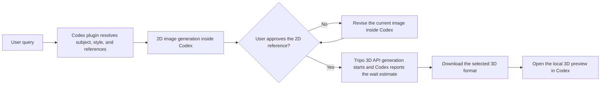

# Codex 3D Asset

<p align="center">
  
</p>

`codex-3d-asset` is a Codex plugin for image-to-3D workflows inside Codex.

It generates clean 2D reference images, keeps the reference editable until approval, checks Tripo wallet credits before paid tasks when available, tells the user when Tripo generation has started with a best-effort wait estimate, downloads the requested format, and opens a local 3D preview widget in Codex.

## Menu

- [Workflow](#workflow)
- [Example Requests](#example-requests)
- [Style Handling](#style-handling)
- [Quick Start](#quick-start)
- [Documentation](#documentation)
- [TODO](#todo)

## Workflow



## Example Requests

Use prompts like these:

- `Generate a low poly knight in a front-view T-pose on pure white, then continue to Tripo and download as GLB.`
- `Generate all low poly assets needed for a football match, keep each asset isolated, and ask before the first Tripo handoff.`
- `Use these references for style, generate the 2D image in Codex, then send the approved image to Tripo and export as FBX.`
- `Create a stylized robot on a white background with no shadow, let me revise the image if needed, then generate the 3D model.`
- `Generate an ice age saber-toothed tiger, show me the style chooser first, and default to GLB for the final model.`
- `Keep the same reference image but make the teeth longer and the fur darker before the 3D step.`

## Style Handling

Supported styles:

- `low_poly`
- `highly_detailed`
- `photorealistic`
- `stylized`
- `toon`
- `voxel`

If the user does not specify a style and does not provide reference images, the plugin asks one short style question and can show the bundled gallery first.

<p align="center">
  
</p>

Example question:

`Which style should I use for the horse: low poly, highly detailed, photorealistic, stylized, toon, or voxel?`

If `AGENTS.md` already defines a default style, the plugin should use it and skip the question.

## Quick Start

Clone the repository:

```bash
git clone https://github.com/anisayari/codex-3d-asset.git
cd codex-3d-asset
```

Install the plugin locally:

```bash
mkdir -p ~/plugins/codex-3d-asset
rsync -a --delete --exclude .git ./ ~/plugins/codex-3d-asset/
```

Make sure Codex can access `TRIPO_API_KEY`:

```bash
export TRIPO_API_KEY="tsk_..."
```

Then refresh Codex so the local plugin descriptors reload.

The plugin bootstrap automatically:

- installs missing local Node dependencies
- starts the local viewer server
- prepares `outputs/`
- writes `.codex-runtime/viewer.json`
- keeps the post-image flow going instead of stopping on the generated image alone
- keeps the post-task flow explicit by reporting when Tripo generation has started and what wait time to expect

## Documentation

- [Installation and Setup](./docs/installation.md)
- [Workflow and Tripo Handoff](./docs/workflow.md)
- [Preferences and AGENTS.md](./docs/preferences.md)
- [Repository Layout and Data Bundle](./docs/package-layout.md)
- [Troubleshooting](./docs/troubleshooting.md)
- [AGENTS Template](./docs/AGENTS.example.md)

## TODO

Possible next improvements:

- add pluggable 3D generation backends beyond Tripo
- support hosted providers such as Replicate and FAL
- support local 3D generation pipelines when the user wants an offline or self-hosted path
- route requests by speed, cost, style, or output quality
- let `AGENTS.md` define a preferred 3D backend and fallback order
- add skeleton and animation support in the MCP server

## License

MIT
